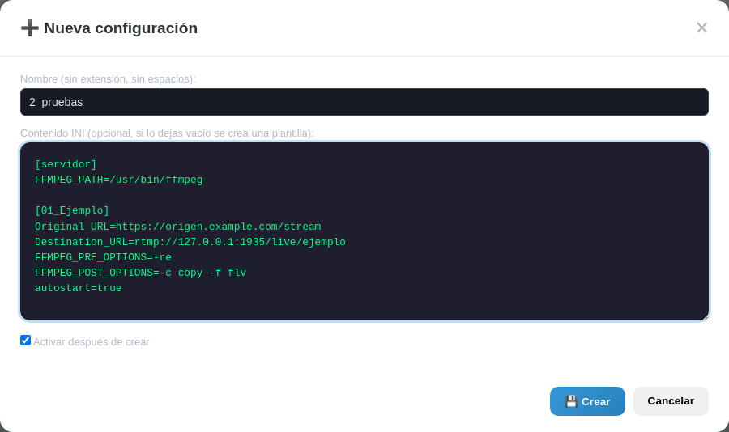
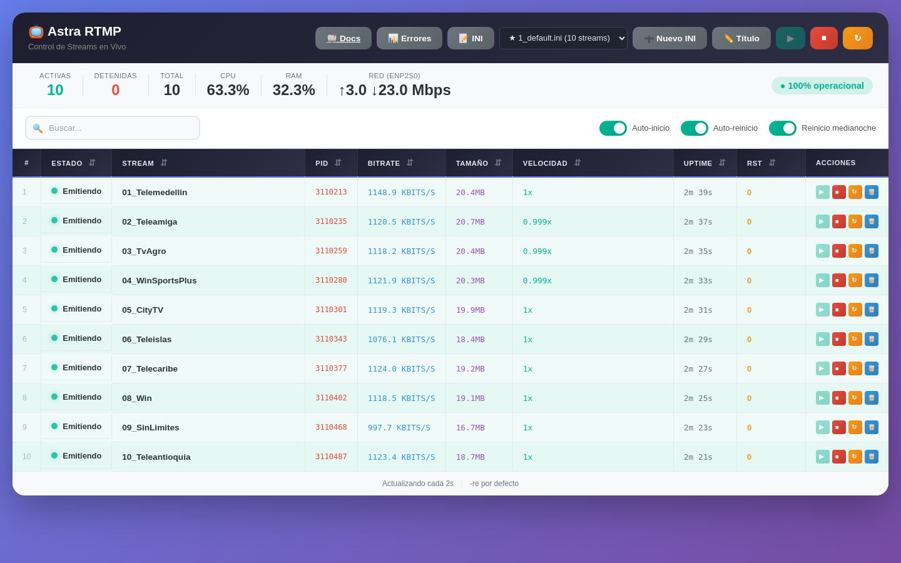
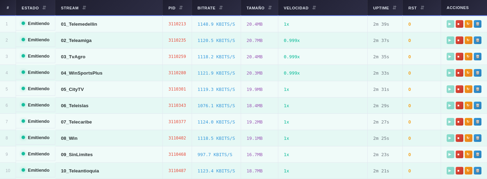
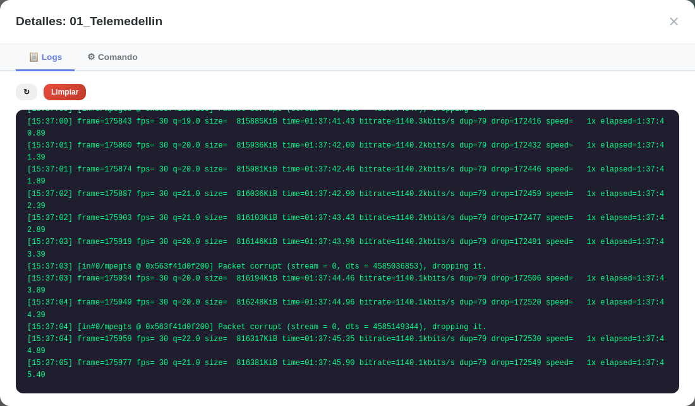
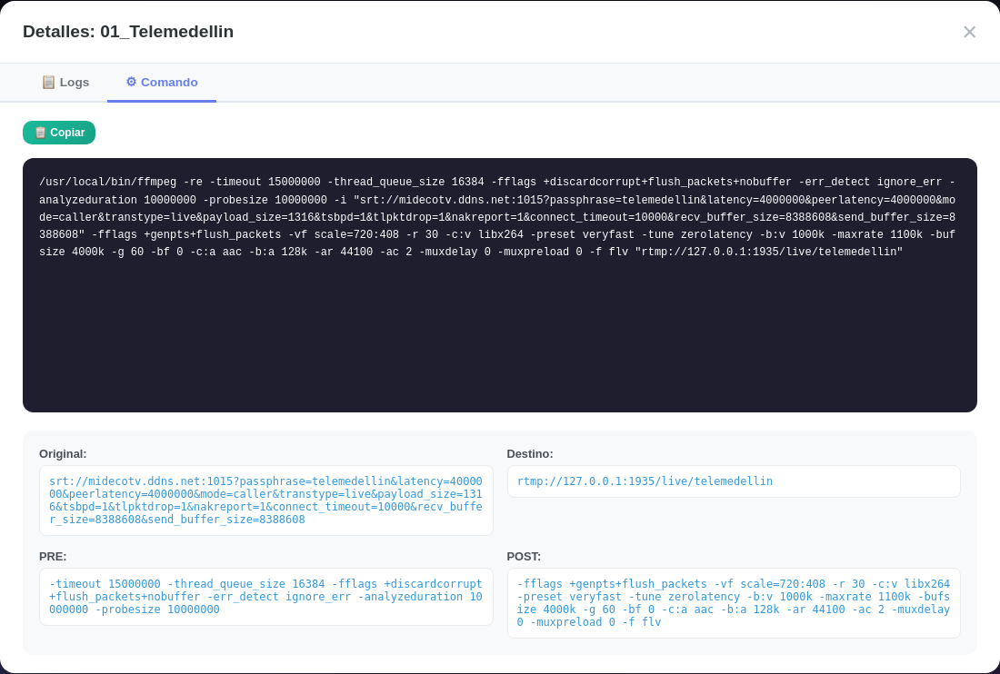
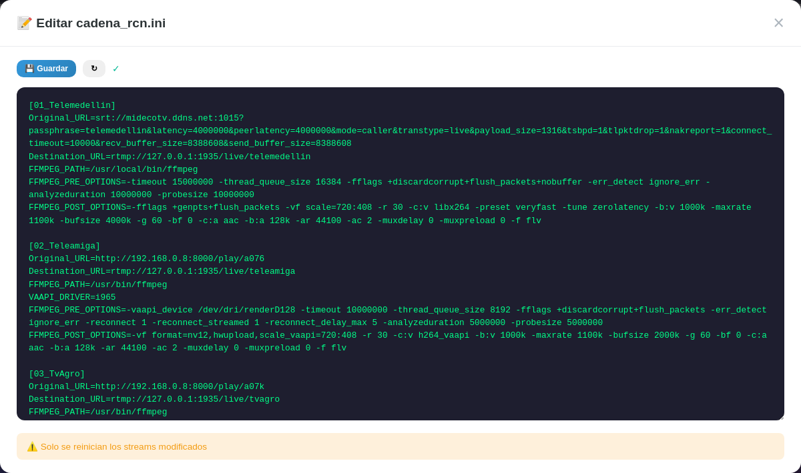
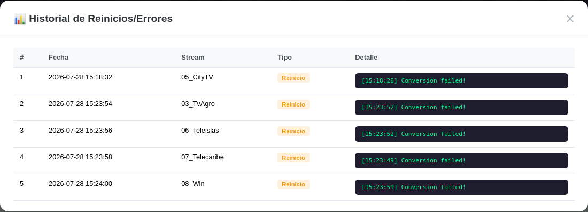

# Sistema de Emisión 24/7 - Astra

Dashboard web para gestión y monitoreo de streams FFmpeg en tiempo real. Control total de múltiples transmisiones simultáneas con monitoreo automático, detección de *freeze* por inactividad de frames, reinicio a medianoche, métricas de sistema (CPU / RAM / red) y limpieza de memoria.

Pensado para correr 24/7 sobre un equipo Linux que recibe fuentes SRT / RTMP / HLS / HTTP y las reemite a un servidor RTMP local (nginx-rtmp) con aceleración por hardware VAAPI.

## Despliegues múltiples (carpeta `db/`)

El sistema carga **una** configuración `.ini` a la vez desde `db/`. Cada archivo es una variante de despliegue (cliente, canal, entorno). Sólo cambia ese archivo; el resto del código es el mismo entre máquinas.

```
sistema_emision_Astra/
├── db/
│   ├── 1_default.ini         ← config activa en este servidor
│   ├── 2_cliente_x.ini
│   └── 3_pruebas.ini
├── app.py
└── …
```

### Selección de la config activa (prioridad)

1. **Variable de entorno** `ASTRA_INI=db/2_cliente_x.ini` → para Docker, CI o pruebas puntuales.
2. **`config.json > active_config`** → elección persistente, editable desde la UI.
3. **Primer** archivo `*.ini` alfabético en `db/`.
4. Legado: `cadena_rcn.ini` en la raíz.

### En la UI

En el header aparece un selector con todas las configs de `db/` y dos botones nuevos:


- **Selector** (★ nombre activo, los demás con su número de streams). Cambiar la selección hace `stop_all` y vuelve a arrancar con la config elegida.
- **➕ Nuevo INI** abre un modal para crear una config nueva:



### En el shell

```bash
# Primera instalación en una máquina nueva (clona el repo y escoge base)
python app.py --init          # migra cadena_rcn.ini de la raíz, o crea db/1_local.ini

# Override puntual sin tocar archivos
ASTRA_INI=db/3_pruebas.ini python app.py
```

`db/*.ini` y `db/*.ini.bak` están en `.gitignore` — cada despliegue mantiene sus datos fuera del repo.

---

## Vista rápida del panel

Al abrir `http://localhost:5006` se ve este panel principal. No tiene contraseñas: corre sólo en la red local y todos los controles son botones.



*Captura real del dashboard con 9 streams emitiendo. La barra superior muestra el conteo de streams activos/detenidos, uso de CPU, RAM y tráfico de red en vivo.*

---

## Guía visual: ¿qué hace cada botón?

### Cabecera (esquina superior derecha)


| Botón | Símbolo | Qué hace |
|---|---|---|
| **📖 Docs** | `📖` | Abre esta documentación renderizada en otra pestaña (`/help`). |
| **📊 Errores** | `📊` | Modal con los últimos 5 reinicios automáticos y errores detectados. |
| **📝 INI** | `📝` | Abre el editor en vivo del INI activo (`db/<active>.ini`). Al guardar se aplica **solo** a los streams modificados (los demás no se reinician). |
| **✏️ Título** | `✏️` | Cambia el nombre que aparece arriba y en la pestaña del navegador. Se guarda en `config.json`. |
| **▶** | verde | **Inicia todos** los streams registrados (`/api/start_all`). |
| **■** | rojo | **Detiene todos** los streams (`/api/stop_all`). |
| **↻** | ámbar | **Reinicia toda la plataforma**: detiene streams, ejecuta `restart_platform.sh` y la UI se reconecta sola al cabo de ~3 s. |

### Barra de estado (debajo del título)


- **Activas / Detenidas / Total** — conteo global en vivo (polling de 2 s).
- **CPU / RAM** — porcentaje instantáneo del equipo.
- **Red (enp2s0)** — Mbps de subida y bajada calculados con `psutil.net_io_counters`.
- **● 100% operacional** — todos los streams corriendo. Cambia a *N detenido(s)* o *Sin actividad* cuando aplique.

### Toolbar (buscador y toggles)


- 🔍 Buscar — filtra la tabla por nombre en tiempo real.
- **Auto-inicio** — al arrancar la app, también se inician los streams (incluso los que no tengan `autostart=true`).
- **Auto-reinicio** — el monitor automático detecta streams congelados o caídos y los relanza.
- **Reinicio medianoche** — entre las 00:00 y las 00:05 hace un *full restart* (libera memoria y relanza todo limpio).

### Tabla principal



Columnas (todas ordenables clicando el header):

| Columna | Significado |
|---|---|
| **#** | Número de fila. |
| **Estado** | ● Emitiendo (verde) / ● Iniciando (amarillo) / ● Detenido (gris) / ● Error (rojo) / ● Reiniciando (amarillo). |
| **Stream** | Nombre de la sección en el INI activo (`db/<active>.ini`). |
| **PID** | PID del proceso `ffmpeg` (o `-` si está detenido). |
| **Bitrate** | Tasa de salida actual (kbits/s). |
| **Tamaño** | Bytes escritos por ffmpeg hasta el momento. |
| **Velocidad** | `speed=` de ffmpeg (1.0x = tiempo real). |
| **Uptime** | Tiempo que lleva emitiendo desde el último `start`. |
| **RST** | Cuántas veces se ha reiniciado automáticamente. |

Botones por fila (`Acciones`):

| Botón | Acción |
|---|---|
| ▶ verde | Inicia *este* stream. |
| ■ rojo | Detiene *este* stream. |
| ↻ ámbar | Reinicia *este* stream. |
| 📋 azul | Abre los **detalles** del stream (logs en vivo + comando FFmpeg generado). |

---

## Modales

### Detalles del stream (📋 por fila)

**Pestaña Logs** — las últimas 200 líneas de stderr de ffmpeg, con auto-refresh cada 2 s. Botones `↻` refrescar y `Limpiar`.



**Pestaña Comando** — comando `ffmpeg` que se está ejecutando, con `Original_URL`, `Destination_URL`, `FFMPEG_PRE_OPTIONS` y `FFMPEG_POST_OPTIONS` desglosados. Botón 📋 Copiar lo lleva al portapapeles.



### Editor de INI (📝 en header)



Edita el **INI activo** (`db/<active>.ini`). El título del modal muestra el archivo que se va a guardar (ej.: `📝 Editar db/1_default.ini`). Al pulsar **💾 Guardar**:

- Se hace backup automático (`<active>.ini.bak`).
- Se valida que el nuevo contenido parse.
- Sólo se reinician los streams **que cambiaron** (los demás ni se tocan).

### Selector de config activa (dropdown en header)


Lista todos los `db/*.ini` y muestra con ★ la activa. Al elegir otra, hace `stop_all`, recarga el INI, aplica los overrides del bloque `[servidor]` (ver más abajo) y arranca los streams marcados con `autostart=true` (o todos si `start_all_on_boot=true`). Devuelve `{active, loaded, started, platform_title, network}`.

### Crear nueva configuración (➕ Nuevo INI)


Pide un nombre (sin extensión, sólo letras / números / guiones) y opcionalmente el contenido INI (si se deja vacío se crea con una plantilla de un stream de ejemplo). Marca "Activar después de crear" para que entre a funcionar de inmediato.

### Historial de errores (📊 en header)



Tabla con los últimos 5 reinicios automáticos: timestamp, nombre del stream, tipo (`restart` por freeze, `restart` por crash, `error` por fallo al iniciar) y el mensaje de ffmpeg asociado.

---

## Arquitectura del Sistema

```
┌────────────────────────────────────────────────────────────────────┐
│                         Flask App (app.py)                          │
│  ┌──────────┐  ┌──────────────┐  ┌──────────────────────────┐      │
│  │ API REST │  │ MidNight     │  │ StreamMonitor            │      │
│  │ /api/*   │  │ Scheduler    │  │ (cada 10s)               │      │
│  └──────────┘  └──────┬───────┘  └──────────┬───────────────┘      │
│                       │                      │                      │
│   get_system_stats()  │                      │                      │
│   (cpu/ram/net)       │                      │                      │
└───────────────────────┼──────────────────────┼──────────────────────┘
                        │                      │
          ┌─────────────┴──────────┐   ┌────────┴────────────────┐
          │   StreamManager        │   │  db/<active>.ini        │
          │   (Singleton)          │   │  + bloque [servidor]    │
          │   + Lock global        │   │  + config.json (legacy) │
          └─────────────┬──────────┘
                        │
          ┌─────────────┴─────────────────────────────────┐
          │                   streams {}                   │
          │  ┌─────────────┐ ┌─────────────┐ ┌─────────┐  │
          │  │ Stream      │ │ Stream      │ │ Stream  │  │
          │  │ Instance    │ │ Instance    │ │ Instance│  │
          │  │ [name1]     │ │ [name2]     │ │ [nameN] │  │
          │  └──────┬──────┘ └──────┬──────┘ └────┬────┘  │
          └─────────┼───────────────┼─────────────┼───────┘
                    │               │             │
              ┌─────┴──────┐  ┌─────┴─────┐  ┌────┴─────┐
              │ ffmpeg -re │  │ ffmpeg -re│  │ ffmpeg -re│
              │ stderr.raw │  │ stderr.raw│  │ stderr.raw│
              │ (split \r  │  │ (split \r │  │ (split \r │
              │  y \n)     │  │  y \n)    │  │  y \n)    │
              │ last_lines │  │ last_lines│  │ last_lines│
              │ (deque)    │  │ (deque)   │  │ (deque)   │
              └───────────┘  └───────────┘  └───────────┘
```

> **Lectura robusta de stderr:** el progreso de ffmpeg llega separado por `\r`, no `\n`. `_read_output` lee el stream con `read1(4096)` y parte tanto por `\r` como por `\n`, parseando `frame=`, `size=`, `time=`, `bitrate=`, `Audio: ... kbps` y `speed=`.

---

## Estado de un Stream

El campo `status` puede valer:

| Valor | Significado |
|---|---|
| `stopped` | Proceso detenido o nunca iniciado. |
| `starting` | Popen ejecutado, a la espera del primer progreso. |
| `running` | FFmpeg emite progreso (`frame=`, `size=` o `time=` avanzando). |
| `error` | Proceso murió o no se pudo iniciar. |
| `restarting` | El monitor decidió reiniciarlo (freeze o crash). |

---

## Actualización parcial del INI

Cuando se guarda el archivo `db/<active>.ini` desde la UI (`POST /api/ini/write`):

1. Se hace una copia del contenido anterior en `db/<active>.ini.bak`.
2. Se valida el contenido nuevo en un archivo temporal (escritura atómica `tmp + fsync + rename`).
3. Se compara la configuración anterior con la nueva.
4. Solo se afectan los streams que cambiaron:
   - **Streams añadidos** → se registran e inician (si `autostart=true` o `start_all_on_boot=true`).
   - **Streams eliminados** → se detienen y se borran del manager.
   - **Streams modificados** → se reinician con la nueva config (sólo si estaban corriendo).
   - **Streams sin cambios** → no se tocan.
5. La respuesta JSON incluye `added`, `changed` y `removed` (listas de nombres).

---

## Detección de Freeze y Reinicio Automático

```
StreamMonitor (cada 10s)
    │
    ├── _check_freeze(name, status)
    │       ├── Si status != "running"           → ignora
    │       ├── Si start_time es None            → ignora
    │       ├── Si now - start_time < 90s        → warmup, ignora
    │       │                                      (los streams IPTV/HLS tardan
    │       │                                       en emitir el primer frame válido)
    │       ├── Lee stream._last_frame_time
    │       ├── Si now - last_frame_time ≤ 60s   → reset contador, OK
    │       └── Si now - last_frame_time > 60s   → contador++
    │                                              └─ contador ≥ 6 (≈60s adicionales)
    │                                                   → restart_stream(name, reason="frozen")
    │
    └── _check_process_health(name, status)
            └── Si status == "running" pero !is_running()
                    → captura get_last_error_from_logs()
                    → status = "error"
                    → restart_stream(name, reason="process_died")

restart_stream(name, reason):
    stop()  ──► error_history.append({type:"restart", reason, message, command})
    restart_count += 1
    sleep(2)
    start()
    └─ si falla → error_history.append({type:"error", reason:"start_failed"})
```

> Con `freeze_threshold=60s` + 6 checks consecutivos + 90s de warmup, el tiempo máximo antes de actuar sobre un stream realmente congelado es de aproximadamente **2 minutos y medio** desde el último progreso real.

---

## Reinicio a Medianoche (Full Memory Clean)

```
Scheduler (hilo daemon)
    │
    └── Calcula next_midnight y duerme hasta entonces (con topes de 60s
        entre comprobaciones para liberar CPU).
            │
            └── Cuando now.hour == 0 and now.minute < 5 and !already_executed:
                    │
                    └── full_restart()
                            ├── stop_all_and_cleanup()
                            │       ├── stream.cleanup() × N streams
                            │       │       ├── stop() → terminate/wait(10s)/kill
                            │       │       ├── close pipes (stderr/stdout/stdin)
                            │       │       ├── last_lines.clear()
                            │       │       └── reset bitrate/size/speed/etc.
                            │       └── gc.collect()
                            ├── sleep(3)  ← pausa para liberación de recursos OS
                            └── stream.start() × N streams  ← reinicio limpio
```

Si el toggle `midnight_restart` está deshabilitado, el scheduler registra el evento pero no detiene los streams.

### Por stream

Cada `StreamInstance` mantiene:

- `last_lines` → `deque(maxlen=1000)` — máximo 1000 líneas de log en memoria.
- `_last_frame_time` → timestamp del último progreso (`frame=` / `size=` / `time=`).
- `_last_ffmpeg_time_value`, `_last_size_value` → métricas acumulativas.
- `_output_thread` → hilo daemon que lee stderr con `read1(4096)` y split `\r` / `\n`.

### Full Restart (cleanup completo)

1. `stop()` → `terminate()` → `wait(10s)` → `kill()` si no responde → cierra pipes.
2. `last_lines.clear()` → libera referencias de strings.
3. `gc.collect()` → fuerza Python a reclamar memoria al OS.
4. `sleep(3)` → pausa para que el OS libere recursos.
5. `stream.start()` × N → reinicio limpio.

---

## Estructura de archivos

```
sistema_emision_Astra/
├── app.py                  # Flask app + scheduler + initialization + /help + multi-config
├── stream_manager.py       # StreamInstance + StreamManager (singleton)
├── monitor.py              # StreamMonitor (freeze/crash detection con warmup)
├── config_parser.py        # Parser del archivo INI (soporta path o content)
├── db/                     # Configuraciones de despliegue (una por .ini, NO se commitean)
│   ├── .gitkeep
│   ├── README.md
│   ├── 1_default.ini       # Canales 01–10 (LAN 127.0.0.1:8000)
│   └── 2_playlist.ini      # Canales 11–N (playlist 192.168.0.8:8000)
├── cadena_rcn.ini.example  # Plantilla sanitizada para el repo (usada por --init)
├── config.json             # Persistencia de toggles + platform_title + active_config (NO se commitea)
├── emisor_v1.sh            # Launcher con título personalizado + exporta ASTRA_INI
├── restart_platform.sh     # Script de reinicio completo del servicio
├── requirements.txt        # flask, psutil, markdown
├── requirements-dev.txt    # playwright (sólo para regenerar capturas)
├── tools/
│   └── take_screenshots.py # Generador de capturas del README (playwright)
├── docs/images/            # Capturas usadas por el README
├── templates/
│   └── index.html          # Dashboard con tabla, modales, toasts, selector de config
├── static/
│   └── style.css           # Estilos completos
└── README.md               # Este archivo
```

## Desplegar en una máquina nueva

```bash
git clone <repo>
cd sistema_emision_Astra
pip install -r requirements.txt

# Opción A: crear un db/1_local.ini desde la plantilla
python app.py --init

# Opción B: clonar la config desde otro servidor
scp otro-servidor:sistema_emision_Astra/db/1_default.ini db/1_local.ini

# Arrancar
python app.py
```

Acceso: `http://localhost:5006`.

---

## API REST

| Método | Endpoint | Descripción |
|---|---|---|
| GET | `/` | Dashboard HTML (título personalizado vía `platform_title`). |
| GET | `/help` | Documentación: renderiza este README.md como HTML. |
| GET | `/api/status` | Estado de streams + `summary` + `system` (cpu/ram/red). |
| POST | `/api/stream/<name>/start` | Iniciar stream. |
| POST | `/api/stream/<name>/stop` | Detener stream. |
| POST | `/api/stream/<name>/restart` | Reiniciar stream individual. |
| GET | `/api/logs/<name>?lines=N` | Obtener logs de un stream (N máx 1000). |
| GET | `/api/stream/<name>/command` | Ver comando FFmpeg generado + config. |
| POST | `/api/start_all` | Iniciar todos los streams. |
| POST | `/api/stop_all` | Detener todos los streams. |
| POST | `/api/restart_platform` | Detener streams, lanzar `restart_platform.sh` y `os._exit(0)`. |
| GET | `/api/config` | Obtener toggles + `platform_title` + `network` (interfaz de red activa). |
| POST | `/api/config` | Guardar toggles y/o `platform_title`. |
| POST | `/api/config/activate` | Cambiar el INI activo: para streams, recarga, aplica overrides del bloque `[servidor]` y devuelve `{active, loaded, started, platform_title, network}`. |
| GET | `/api/ini/read` | Leer archivo INI. |
| POST | `/api/ini/write` | Guardar INI (validación + backup + actualización parcial). |
| GET | `/api/errors` | Historial de últimos 5 reinicios / errores. |

---

## Formato `cadena_rcn.ini`

```ini
[Nombre_Del_Stream]
Original_URL=https://fuente.com/stream
Destination_URL=rtmp://servidor.com/live/stream
FFMPEG_PRE_OPTIONS=-re -user_agent "Mozilla/5.0"
FFMPEG_POST_OPTIONS=-c copy -f flv
autostart=true
```

| Campo | Obligatorio | Descripción |
|---|---|---|
| `Original_URL` | sí | Fuente a leer (HLS, RTMP, HTTP, SRT, etc.). |
| `Destination_URL` | sí | Destino donde reemitir (normalmente `rtmp://127.0.0.1:1935/live/<key>`). |
| `FFMPEG_PRE_OPTIONS` | no | Flags antes de `-i`, ej. `-re -user_agent "..."`. |
| `FFMPEG_POST_OPTIONS` | no | Flags después de `-i`, ej. `-c copy -f flv`. |
| `autostart` | no | `true` / `false`. Iniciar al arranque (o en guardado del INI). |
| `ffmpeg_path` | no | Ruta al binario ffmpeg (default `ffmpeg`). |
| `vaapi_driver` | no | Driver VAAPI (`i965`, `iHD`). Se exporta como `LIBVA_DRIVER_NAME`. |

> El comando final siempre lleva `-re` antepuesto. Ejemplo:
> `ffmpeg -re -user_agent "Mozilla/5.0" -i <Original_URL> -c copy -f flv <Destination_URL>`

---

## Toggles de configuración (`config.json`)

| Campo | Default | Efecto |
|---|---|---|
| `start_all_on_boot` | `true` | Si true, al iniciar la app también arranca los streams con `autostart=false`. |
| `auto_restart` | `true` | Si true, el monitor reinicia streams congelados o caídos. |
| `midnight_restart` | `true` | Si true, a las 00:00–00:05 ejecuta `full_restart()` para liberar memoria. |
| `platform_title` | `Sistema de Emisión 24/7-Astra` | Título del dashboard y de la pestaña del navegador (se sanitiza contra `<>"'&`, máx 100 chars). |

`platform_title` se puede editar desde la UI con el botón **✏️ Título**; al guardar se persiste en `config.json` y se aplica al `<h1>` y al `document.title`.

---

## Overrides por despliegue: bloque `[servidor]`

Además de los toggles en `config.json`, cada INI de `db/` puede llevar un bloque opcional `[servidor]` con ajustes que aplican **sólo a ese despliegue**. Esto evita editar `config.json` a mano cuando una misma máquina corre configs distintas para clientes distintos.

```ini
[servidor]
Title=Astra RTMP - Telemedellín
Network=enp2s0
Night_Restart=true
Auto_Restart=true
Start_All_On_Boot=true
```

| Clave INI | Tipo | Default si falta | Efecto |
|---|---|---|---|
| `Title` | string | valor de `config.json > platform_title` | Nombre de la plataforma en el `<h1>` y la pestaña del navegador. |
| `Network` | string | `enp2s0` | Interfaz de red que se monitoriza en la barra de estado (Mbps ↑/↓). |
| `Night_Restart` | bool | `config.json > midnight_restart` | Activa/desactiva el `full_restart` entre 00:00 y 00:05. |
| `Auto_Restart` | bool | `config.json > auto_restart` | Activa/desactiva el monitor de freeze / crash. |
| `Start_All_On_Boot` | bool | `config.json > start_all_on_boot` | Arranca los streams al levantar la app aunque no tengan `autostart=true`. |

**Precedencia** (de mayor a menor):

1. Claves presentes en `[servidor]` del INI activo.
2. Valores guardados en `config.json`.
3. Constantes hardcodeadas (`enp2s0`, `true`, etc.).

Los overrides se releen en dos momentos:

- **Al arrancar la app** (`_apply_deployment_overrides()` en `app.py`).
- **Al cambiar de INI activo** (`POST /api/config/activate`).

Tras aplicar los overrides, las métricas de red se reinicializan contra la nueva interfaz para no arrastrar lecturas anteriores.

`cadena_rcn.ini.example` incluye una sección `[servidor]` mínima como punto de partida; los INI reales de `db/` pueden ampliarla.

---

## Métricas de sistema (`get_system_stats`)

Se exponen en `/api/status > system` y se muestran en la barra de estado superior.

| Métrica | Fuente |
|---|---|
| `cpu_percent` | `psutil.cpu_percent(interval=None)` |
| `mem_percent` | `psutil.virtual_memory().percent` |
| `net_interface` | `enp2s0` por defecto; sobreescribible desde `[servidor] Network=` del INI activo |
| `upload_mbps`   | Δ `bytes_sent` × 8 / Δt / 1e6 |
| `download_mbps` | Δ `bytes_recv` × 8 / Δt / 1e6 |

El indicador textual del estado global cambia según `summary.all_running`:

- todos corriendo → **● 100% operacional**.
- alguno detenido → **● N detenido(s)**.
- ninguno corriendo → **● Sin actividad**.

---

## Toasts (notificaciones)

Las operaciones de iniciar / detener / reiniciar / mostrar logs / editar título / guardar INI muestran un toast temporal arriba a la derecha:

- ✓ Éxito → **verde**.
- ✗ Error → **rojo**.
- ⚠ Warning → **naranja**.
- ℹ Info → **azul**.

---

## Dependencias

Runtime (`requirements.txt`):

```
flask>=2.3.0
psutil>=5.9.0
markdown>=3.5      # usado por /help (import lazy)
```

Instalar con:

```bash
pip install -r requirements.txt
```

Si además quieres regenerar las capturas del README, instala Playwright aparte:

```bash
pip install playwright
python -m playwright install chromium
python tools/take_screenshots.py
```

---

## Ejecución

```bash
# Directo
cd sistema_emision_Astra
python app.py

# Con título personalizado en terminal
./emisor_v1.sh

# Con xfce4-terminal (autostart de sesión)
xfce4-terminal --hold -e "bash -c 'cd /ruta/al/sistema_emision_Astra && sleep 2 && ./emisor_v1.sh; exec bash'" &
```

Acceso: `http://localhost:5006`.

Reinicio completo desde la UI: botón ↻ del header (detiene streams, ejecuta `restart_platform.sh` y la app se relanza; la UI se reconecta automáticamente).

---

## Manejo de errores

- **Stream congelado** — warmup 90 s + 60 s sin progreso de `frame=`/`size=`/`time=` × 6 checks → restart automático (`reason="frozen"`).
- **Process muerto** — `status == "running"` pero `poll() != None` → restart (`reason="process_died"`), error capturado del último log.
- **Error al iniciar** — captura excepción, `status="error"`, mensaje visible.
- **API error** — try / except en todos los endpoints, retorna JSON con `success: false` y `error`.

---

## Mantenimiento

### Ver logs del servidor (consola donde corre la app)

```bash
# Los print() y logger.info() del scheduler y monitor van a stdout/stderr.
```

### Ver procesos FFmpeg activos

```bash
ps aux | grep ffmpeg
```

### Reiniciar manualmente sin esperar medianoche

- **Plataforma completa**: botón ↻ del header, o

  ```bash
  bash restart_platform.sh /tmp/emision_app.log
  ```

- **Sólo streams**:

  ```bash
  curl -X POST http://localhost:5006/api/stop_all
  curl -X POST http://localhost:5006/api/start_all
  # o desde la UI con ▶ y ■
  ```

### Editar INI y guardar

Botón **📝 INI** en la UI → abre editor → guardar → actualización parcial:

- Streams nuevos → se inician.
- Streams eliminados → se detienen y eliminan.
- Streams modificados → se reinician (si estaban corriendo).
- Streams sin cambios → no se tocan.
- Si el nuevo INI no parsea → no se aplica y se devuelve error.
- Siempre se respalda en `db/<active>.ini.bak` antes de sobrescribir.

### Cambiar el título de la plataforma

Botón **✏️ Título** → introduce el nuevo nombre → Enter. Se guarda en `config.json > platform_title`, se aplica al `<h1>` del header y al `document.title` del navegador. Se sanitiza contra `< > " ' &` y se trunca a 100 caracteres.

### Ver historial de errores

Botón **📊 Errores** en header → modal con tabla de últimos 5 reinicios:

- Timestamp, stream, tipo (Reinicio / Error) y mensaje de error de FFmpeg.
- Útil para diagnosticar problemas recurrentes en links o comandos.

---

## Sobre la publicación de capturas

Las capturas del README se generan con Playwright contra la app en vivo:

```bash
python tools/take_screenshots.py
```

El script conecta a `http://127.0.0.1:5006`, espera a que la tabla se llene y guarda cada PNG en `docs/images/`. Útil cuando se quiere actualizar la documentación tras un cambio visual en la UI.

---

## Licencia

Uso interno. Sin contraseñas porque el panel corre únicamente en LAN; no exponer el puerto 5006 a Internet sin protección adicional.
